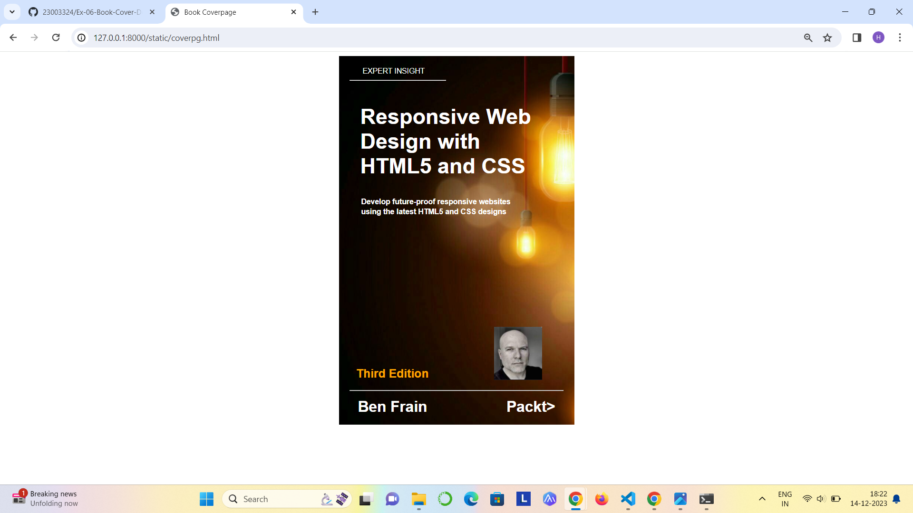

# Ex-06-Book-Cover-Design

NAME: GURU REVANTH KUMARAVEL RADHIKA

REFERENCE NUMBER : 23004484

DEPARTMENT: AI & DS

# AIM:
To design a book-cover-design using HTML and CSS.

# DESIGN PROCEDURE:
## STEP 1:
Start define the document type as HTML.
## STEP 2:
Open the HTML structure with necessary head and body sections.In the head section ,set the title as Book Coverpage and define the styles for the bookcover.Use the CSS styles in the code.The styles include:

background-color,

background-image,

background-position,

background-repeat,

cellpadding,

font-size,

font-family,

display,

line-height.

## STEP 3:
In the body section ,create a division with the text with respective to the headings:

"EXPERT INSIGHT"

"Responsive Web Design with HTML5 and CSS "

"Develop future-proof responsive websites"

"using the latest HTML5 and CSS designs"

"Third Edition"

"Ben Frain"
## STEP 4:
Close the HTML structure.

# CODE:
```
<!DOCTYPE html>
<html lang="en">
    <head>
        <title>Book Coverpage</title>
        <style>
        h1{
           color:white;
        }
         .bookpage{
             width: 400px;
             height: 650px;
             
             margin-left: auto;
             margin-right: auto ;
             padding: 20px;
             background-image: url('lamp.png');
             background-position: center;
             background-color: black;
             background-repeat: no-repeat;
         }
         .toptext{
             color:white;
             padding-left: 5px;
             font-size: 14px;
             font-family: Arial, Helvetica, sans-serif;
             
         }
         .tophr{
             color: orange;
              width: 180px;
         }
         hr{
             color: orange;
            
         }
         .booktitle{
             font-family: Arial, Helvetica, sans-serif;
             padding: 10px 10px 0px 10px;
             display: flex;
             align-items: center;
             justify-content: center;
             margin-right: 10px;
             margin-left: 10px;
             font-size: 20px;
             line-height:normal;
         }
         .author{
             color:white;
             display:inline;
             position:relative;
             font-family: Arial, Helvetica, sans-serif;
             display: inline;
             font-size: 24px;
             line-height: 5px;
              
             
         }
         .sub-text {
             color:white;
             font-family: Arial, Helvetica, sans-serif;
             display: flex;
             line-height: 5px;

            
            
  margin-right: 10px;
  margin-left: 10px;

  font-size: 14px;
  }
  
.footer {
    color:orange;
    padding-top:180px;
}
.image {
    color:white;
             font-family: Arial, Helvetica, sans-serif;
    font-size: 22px;
    margin-right: px;
}
.bottomhr { 
    color: red;
              width: 400px;

}
img {
    width: 90px;
    height: 100px;
    margin-right: 20px;
    vertical-align:bottom;
}
.edition {
    color:orange;
             font-family: Arial, Helvetica, sans-serif;
    font-size: 22px;
    line-height: bottom;
 
}


        </style>
        </head>
            <body>
                <div class="bookpage">
                    <div class="toptext">&nbsp;&nbsp;&nbsp;&nbsp;&nbsp;EXPERT INSIGHT</div>
                    <div class="tophr"><hr></div> 
               <div class="booktitle"><h1> Responsive Web Design with HTML5 and CSS </h1></div>
               <h3 class="sub-text">&nbsp;&nbsp;&nbsp;Develop future-proof responsive websites</h3>
                    <h3 class="sub-text">&nbsp;&nbsp;&nbsp;using the latest HTML5 and CSS designs</h3>
                    <div class="footer">
                        <h2 class="edition">&nbsp;&nbsp;Third Edition&nbsp;&nbsp;&nbsp;&nbsp;&nbsp;&nbsp;&nbsp;&nbsp;&nbsp;&nbsp;&nbsp;&nbsp;&nbsp;&nbsp;&nbsp;&nbsp;&nbsp;&nbsp;&nbsp;  </h2>
                        <div class="bottomhr"><hr></div>
                    <div class="author"><h3>&nbsp;&nbsp;Ben Frain &nbsp;&nbsp;&nbsp;&nbsp;&nbsp;&nbsp;&nbsp;&nbsp;&nbsp;&nbsp;&nbsp;&nbsp;&nbsp;&nbsp;&nbsp;&nbsp;&nbsp;&nbsp;Packt></h3></div>
                    
                </div>
                </div> 
                
            </body>
        
    
</html>

```
# OUTPUT:





# RESULT:
Thus the book-cover-design has been successfully created using HTML and CSS.